```{r, include = FALSE}
knitr::opts_chunk$set(
  collapse = TRUE,
  comment = "#>"
)
```
The `yaleBraille` package renders graphics intended to support data visualization for low-vision and blind end-users. In particular, the `_br` functions print plots to .pdf files, utilizing syntax similar to R's base plotting functions.

```{r}
library(yaleBraille)
```

The `yaleSports` dataset derives from a sandbox dataset utilized in the Yale School of Public Health (`?yaleSports`) for more information.

<br><br><br>
For a box plot, use `boxplot_br` in lieu of `boxplot`:

```{r, eval=FALSE}
data("yaleSports", package = "yaleBraille")
boxplot_br(Height ~ Sport, data = yaleSports,
           over = "Box Plot",
           main = "Yale Athletics Dataset",
           xlab = "x-axis = Sport",
           ylab = "y-axis = Height (inches)",
           stem = "plotBox")
```

This will yield a two-page .pdf with the following images:

```{r, echo=FALSE, out.width="45%", fig.show="hold", fig.align="default", fig.cap=c("Braille-Annotated Box Plot (left) and Text-Annotated Box Plot (right)")}
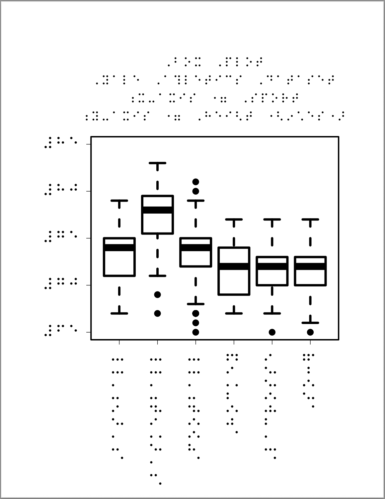
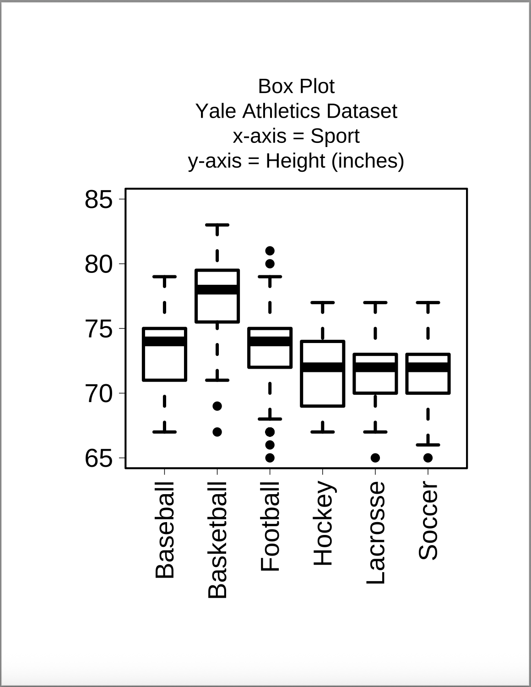
```

<br><br><br>
For a scatter plot, use `plot_br` in lieu of `plot`:

```{r, eval=FALSE}
data("yaleSports", package = "yaleBraille")
plot_br(Weight~Height,data=yaleSports,
		      over="Scatter Plot",
		      main="Yale Athletics Dataset",
		      xlab="x-axis = Height (inches)",
		      ylab="y-axis = Weight (pounds)",
		      stem="plotScatter")
```

yielding

```{r, echo=FALSE, out.width="45%", fig.show="hold", fig.align="default", fig.cap=c("Braille-Annotated Scatter Plot (left) and Text-Annotated Scatter Plot (right)")}
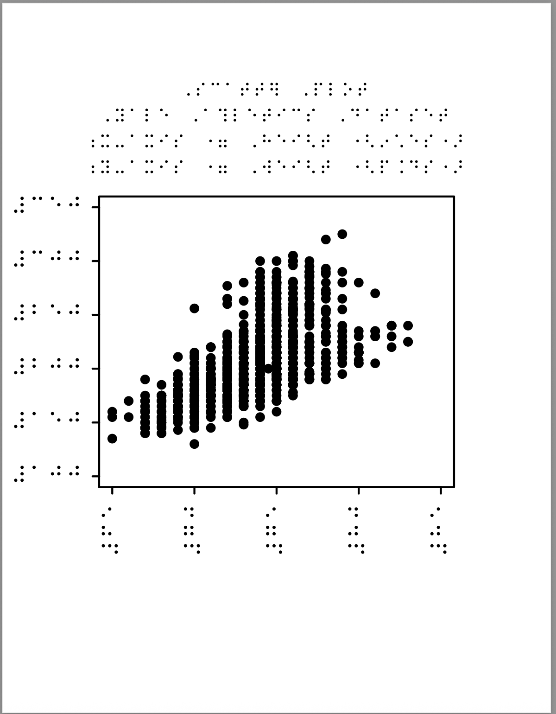
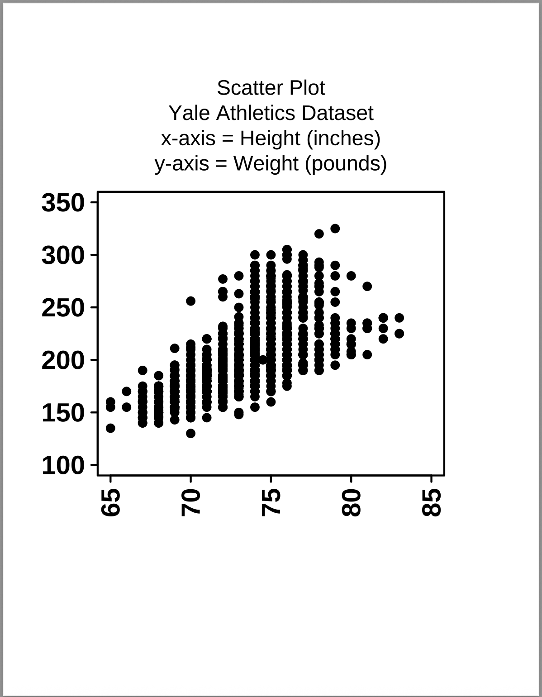
```

<br><br><br>
For a line plot, use `plot_br` with `type="l"` or `type="b"`:

```{r, eval=FALSE}
data("yaleSports", package = "yaleBraille")
plot_br(sort(yaleSports$Weight[1:20]),
		over="Scatter Plot",
		main="Yale Athletics Dataset",
		xlab="Athlete (sorted)",
		ylab="y-axis = Weight (pounds)",
		type="b",
		stem="plotLine")
```

yielding

```{r, echo=FALSE, out.width="45%", fig.show="hold", fig.align="default", fig.cap=c("Braille-Annotated Line Plot (left) and Text-Annotated Line Plot (right)")}
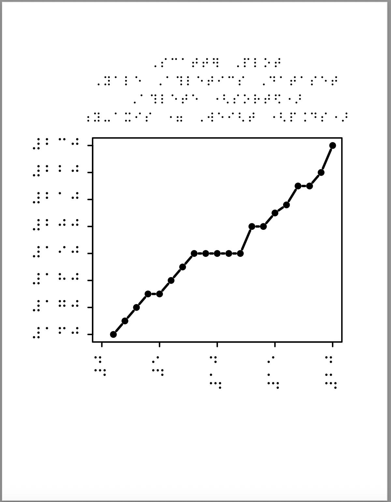
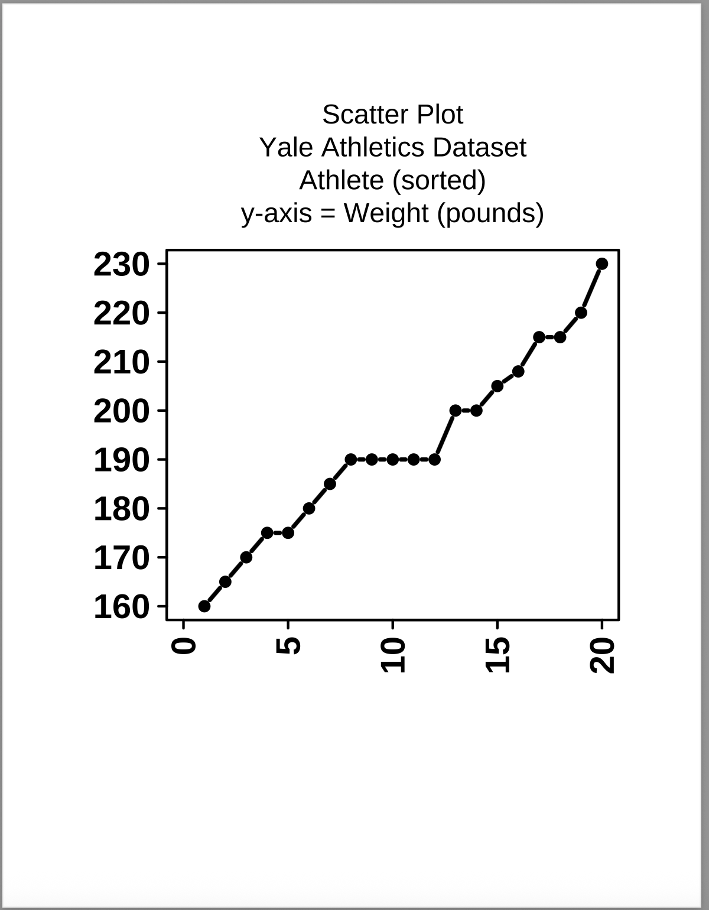
```

<br><br><br>
For a pie chart, use `pie_br` in lieu of `pie`:

```{r, eval=FALSE}
data("yaleSports", package = "yaleBraille")
tbl=table(yaleSports$Sport)
pie_br(tbl,
		over="Pie Chart",
		main="Yale Athletics Dataset",
		xlab=" ",
		ylab=" ",
		stem="plotPie")
```

yielding

```{r, echo=FALSE, out.width="45%", fig.show="hold", fig.align="default", fig.cap=c("Braille-Annotated Pie Chart (left) and Text-Annotated Pie Chart (right)")}
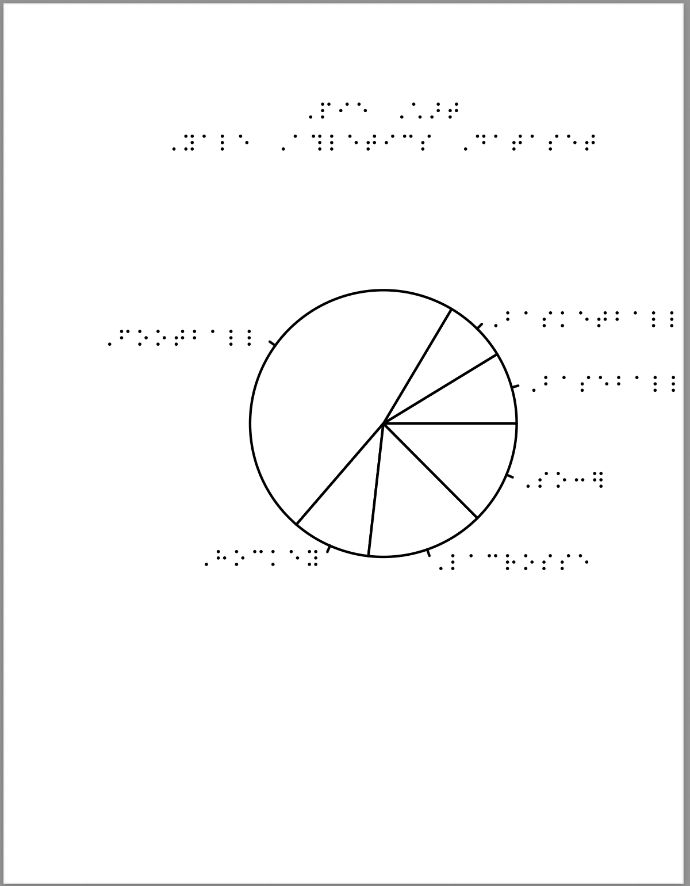
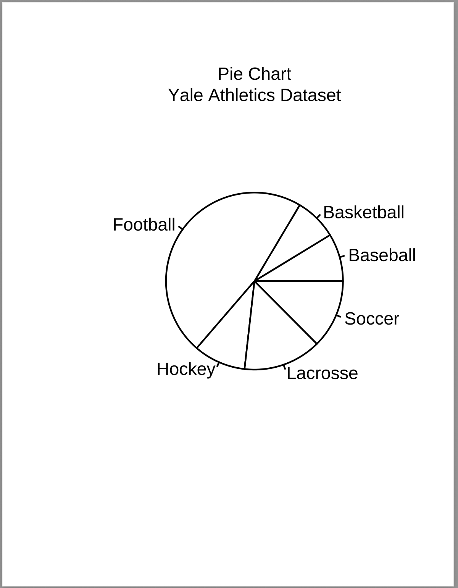
```

<br><br><br>
For a bar chart, use `barplot_br` in lieu of `barplot`:

```{r, eval=FALSE}
data("yaleSports", package = "yaleBraille")
tbl=table(yaleSports$Sport)
barplot_br(tbl,
        over="Bar Chart",
        main="Yale Athletics Dataset",
        xlab="x-axis = Sport",
        ylab="y-axis = Count (n athletes)",
        stem="plotBar")
```

yielding

```{r, echo=FALSE, out.width="45%", fig.show="hold", fig.align="default", fig.cap=c("Braille-Annotated Bar Plot (left) and Text-Annotated Bar Plot (right)")}
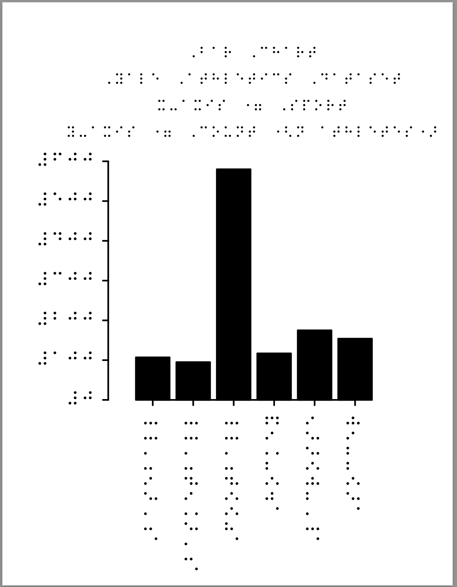
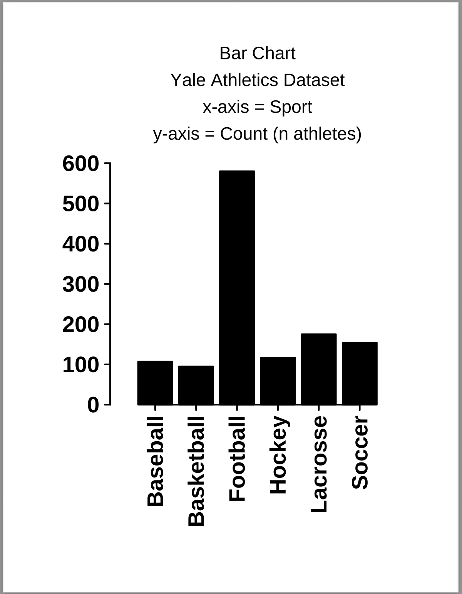
```

<br><br><br>
For a histogram chart, use `hist_br` in lieu of `hist`:

```{r, eval=FALSE}
data("yaleSports", package = "yaleBraille")
hist_br(yaleSports$Weight,
		over="Histogram",
		main="Yale Athletics Dataset",
		xlab="x-axis = Bodyweight (pounds)",
		ylab="y-axis = Count (n athletes)",
		stem="plotHist")
```

yielding

```{r, echo=FALSE, out.width="45%", fig.show="hold", fig.align="default", fig.cap=c("Braille-Annotated Histogram (left) and Text-Annotated Histogram (right)")}
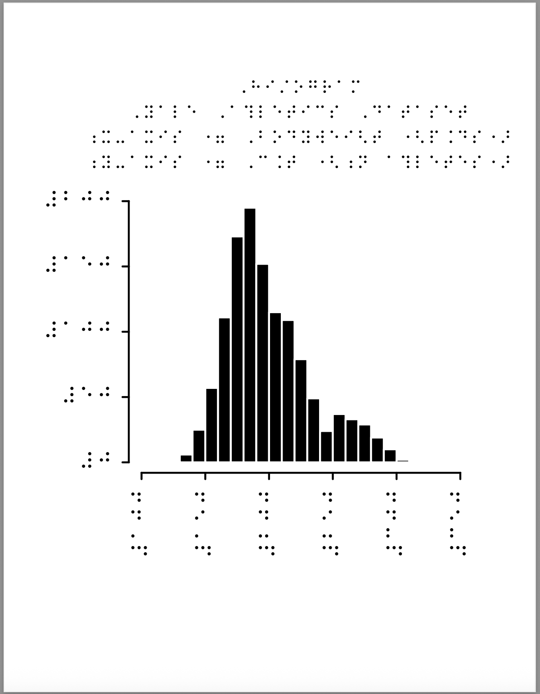
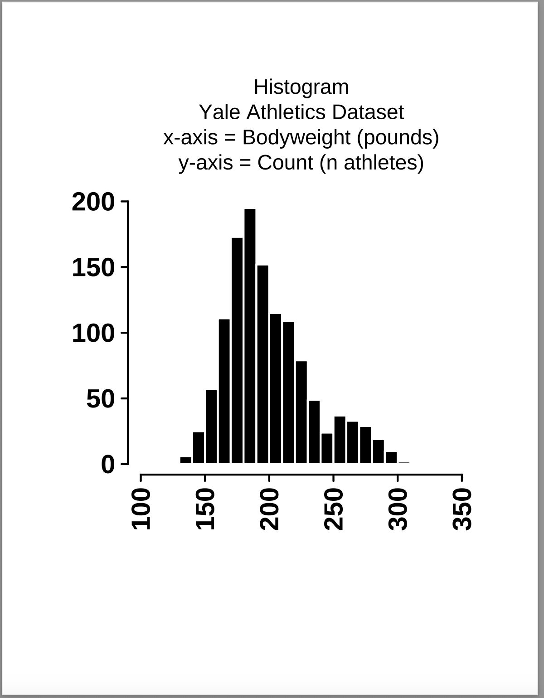
```

### Notes
1. Figures may appear right-adjusted on page. This is to allow a 1-inch print margin at-right, and a wider allocation at-left for y-tick labels
2. Axis labels are moved to graphical top to allow maximum space to tick labels, and to provide maximum information "up-front"
3. In addition to the main-title, an over-title accommodates additional context, e.g. the type of graph being rendered
4. Graphics are intended for swell-printing: black ink (and only black ink) swells into raised surface for touch
5. Recommendation for bars/areas as black and edges as white, except for pie charts (area as white and edges as black)

<br><br><br>


